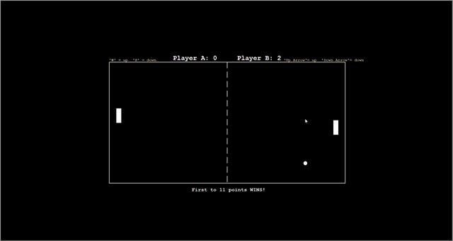

# Instructions:
NOTE: This application is meant to run on Windows OS

This is a 2-Player game:

Player A: 
- Use 'w' to move paddle up
- Use 's' to move paddle down

Player B:
- Use 'Up Arrow' to move paddle up
- Use 'Down Arrow' to move paddle down

**Features of Game:**
- 8-bit arcade style sound effects for when ball hits wall or paddle and when a player scores
- Scoreboard for keeping score
- Increased speed of ball over time with a max limit to keep game playable in the event of a long game
- Display of winner when a player reaches 11 points

NOTE: For best experience, use application in fullscreen mode

# **To run Pong Game on Windows OS:**
1. Download the repository Zip file
2. Extract the Zip file and open extracted folder
3. Open the "Game" folder and open the .exe file named "pong.exe" to run the game

NOTE: an error message may pop-up when opening and closing the "pong.exe" file, just click 'ok' and the program should still run smoothly
NOTE: For best experience, use application in fullscreen mode

# **To run Pong Game on other OS:**
1. Download the latest version of Python from [Python.org](https://www.python.org/)
2. Download a Python IDE such as Pycharm
3. Download the Zip file from this repository and extract it
4. Open the extracted folder in the Python IDE and run the "pong.py" file

NOTE: For best experience, use application in fullscreen mode

Here is a GIF that shows a demo of the game:

# Unit Testing

Python's in-built unit testing module was used by using "import unittest".
A seperate file was created in which the unit tests were written.
There were only four functions used in the entire Pong game which were for moving the paddles up and down so four unit tests were made.

To see the unit tests in action and their result, open the "test_pong.py" file in a Python IDE such as Pycharm and run the file.
All the unit tests made were all passed and so 'OK' was displayed in the console.
